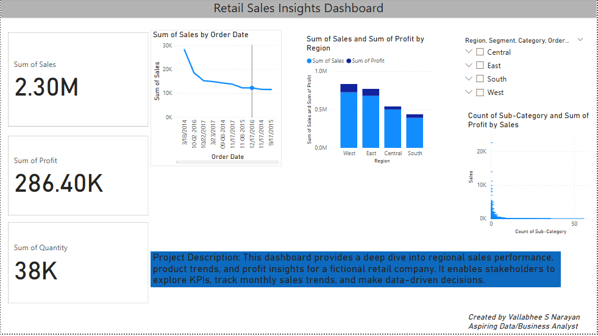

# 🛍️ Retail Sales Insights Dashboard

## 📊 Project Overview

This Power BI dashboard analyzes fictional retail data from the Superstore dataset. It enables users to explore key business metrics, product performance, regional trends, and overall sales insights.

## 🔍 Features

- 📈 Time-based Sales Trend
- 🌍 Region-wise Sales & Profit Comparison
- 📦 Category/Sub-category Performance
- 🎯 Interactive Filters (Slicers)
- 🧮 Key Metrics: Total Sales, Profit, Quantity

## 📁 Tools Used

- Power BI
- Excel (for cleaning)
- DAX (for KPIs and calculated fields)

## 🧠 Business Questions Answered

- Which region is the top performer in terms of profit?
- What are the highest and lowest-selling product categories?
- How do monthly sales trends look across different segments?

## 👤 Created By

**Vallabhee S Narayan**  
Aspiring Data/Business Analyst  
[LinkedIn](https://www.linkedin.com/in/vallabhee03)
